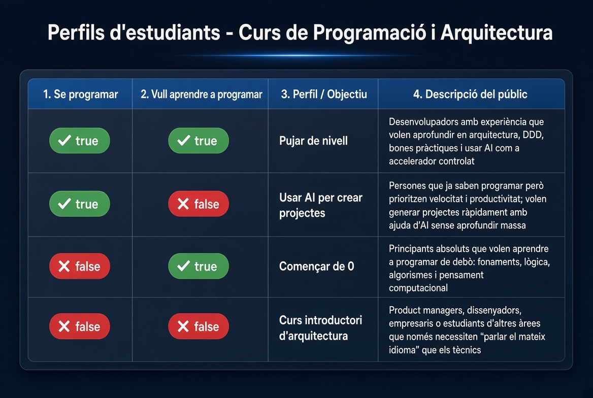

# Whitepaper — Compàs / compassMap

**Título del producto:** Compàs de Programació i Arquitectura  
**Nombre del proyecto:** compassMap  
**Versión del documento:** 0.1  
**Idioma del producto:** catalán  
**Estado:** borrador estructurado

---

## 1. Resumen ejecutivo

**compassMap** es una aplicación que genera un **roadmap de aprendizaje personalizado** a partir de una matriz sencilla de dos preguntas binarias:

1. ¿Sabes programar?
2. ¿Quieres aprender (o seguir aprendiendo) a programar?

Con esas dos respuestas, el sistema clasifica al usuario en uno de **cuatro perfiles** y le propone un itinerario concreto: subir de nivel, usar IA para crear proyectos, empezar de cero, o un curso introductorio de arquitectura.

La idea central es simple: **no todo el mundo necesita el mismo camino**. Un único curso lineal deja fuera a principiantes, a profesionales que quieren profundizar, a quienes priorizan productividad con IA y a perfiles no técnicos que solo necesitan hablar el mismo idioma que el equipo de desarrollo.

---

## 2. Problema

En formación de programación y arquitectura suele asumirse un público homogéneo. En la práctica conviven al menos cuatro necesidades distintas:

| Situación | Qué suele fallar |
|-----------|------------------|
| Principiante motivado | Empieza demasiado arriba (frameworks, cloud) y se bloquea |
| Desarrollador con experiencia | Repite fundamentos o no encuentra foco en arquitectura / buenas prácticas |
| Programador orientado a entrega | Quiere velocidad y proyectos, no otro temario teórico profundo |
| Perfil no técnico (PM, diseño, negocio) | No quiere codear, pero sí entender arquitectura y conversar con el equipo |

Sin un filtro inicial claro, el contenido se diluye y el roadmap deja de ser útil.

---

## 3. Propuesta de valor

**Una matriz de 2×2 + un roadmap por celda.**

El usuario se autoubicá con dos dimensiones booleanas. El sistema no inventa un diagnóstico complejo: **mapea perfil → objetivo → itinerario**.

### Dimensiones

| Dimensión | Pregunta | Valores |
|-----------|----------|---------|
| A — Competencia | ¿Sé programar? | `true` / `false` |
| B — Intención | ¿Quiero aprender a programar? | `true` / `false` |

### Resultado

Para cada combinación `(A, B)` el producto entrega:

- un **perfil / objetivo** nombrado
- una **descripción del público**
- un **roadmap** alineado con ese objetivo

---

## 4. Matriz de perfiles

Fuente visual del producto:



### Tabla de decisión

| Sé programar | Vull aprendre a programar | Perfil / Objectiu | Descripció del públic |
|--------------|---------------------------|-------------------|------------------------|
| `true` | `true` | **Pujar de nivell** | Desarrolladores con experiencia que quieren profundizar en arquitectura, DDD, buenas prácticas y usar la IA como acelerador controlado. |
| `true` | `false` | **Usar AI per crear projectes** | Personas que ya saben programar y priorizan velocidad y productividad: generar proyectos rápido con ayuda de IA, sin profundizar demasiado en lo técnico. |
| `false` | `true` | **Començar de 0** | Principiantes absolutos que quieren aprender de verdad a programar: fundamentos, lógica, algoritmos y pensamiento computacional. |
| `false` | `false` | **Curs introductori d'arquitectura** | Product managers, diseñadores, emprendedores o estudiantes de otras áreas que solo necesitan “hablar el mismo idioma” que el equipo técnico. |

### Lectura en lenguaje natural

1. **Sabes programar y quieres seguir aprendiendo** → roadmap de **subir de nivel**.  
2. **Sabes programar y no quieres seguir aprendiendo a fondo** → roadmap de **IA para crear proyectos**.  
3. **No sabes programar y quieres aprender** → roadmap de **empezar de 0**.  
4. **No sabes programar y no quieres aprender a programar** → roadmap de **arquitectura introductoria** (sin foco en codear).

---

## 5. Flujo del producto

1. El usuario entra en el **Compàs de Programació i Arquitectura**.  
2. Responde (o explora) las dos dimensiones: *Sé programar* / *Vull aprendre*.  
3. Puede interactuar con **botones** o con la **matriz visual** (cuatro celdas).  
4. El sistema determina el perfil activo.  
5. Se genera / muestra el **roadmap** asociado a ese perfil.  
6. (Opcional / futuro) gamificación: puntos, nivel y desbloqueo de perfil.

Referencias de interfaz actuales:

- [Mockup 1](./mockup/view-mockup-1.png) — matriz y celdas  
- [Mockup 2](./mockup/view-mockup-2.png) — interacción con toggles  
- [Mockup 3](./mockup/view-mockup-3.png) — progreso / nivel  

---

## 6. Roadmaps por perfil (contenido a detallar)

Cada perfil debe acabar materializado como un itinerario concreto (módulos, hitos, recursos). Esta sección define el **contrato** del whitepaper; el detalle pedagógico se irá rellenando por versión.

### 6.1 Pujar de nivell (`true`, `true`)

- **Objetivo:** pasar de “sé programar” a “diseño y construyo mejor”.  
- **Ejes sugeridos:** arquitectura de software, DDD, buenas prácticas, uso controlado de IA.  
- **Roadmap (placeholder):** fundamentos de arquitectura → patrones → DDD → práctica con proyectos → IA como acelerador.

### 6.2 Usar AI per crear projectes (`true`, `false`)

- **Objetivo:** maximizar entrega y velocidad con IA.  
- **Ejes sugeridos:** prompting aplicado, flujo de generación de código, revisión, entrega de MVPs.  
- **Roadmap (placeholder):** setup de herramientas → ciclo idea→código→demo → calidad mínima → portfolio de proyectos rápidos.

### 6.3 Començar de 0 (`false`, `true`)

- **Objetivo:** aprender a programar desde la base.  
- **Ejes sugeridos:** lógica, algoritmos, pensamiento computacional, primer lenguaje, primeros proyectos.  
- **Roadmap (placeholder):** pensamiento computacional → sintaxis y tipos → control de flujo → estructuras → primer proyecto guiado.

### 6.4 Curs introductori d'arquitectura (`false`, `false`)

- **Objetivo:** alfabetización técnica sin convertirse en programador.  
- **Ejes sugeridos:** capas, APIs, datos, despliegue, vocabulario compartido con ingeniería.  
- **Roadmap (placeholder):** qué es un sistema → frontend/backend/datos → APIs → entornos → cómo hablar con el equipo técnico.

> **Nota de versión 0.1:** los roadmaps están definidos a nivel de objetivo y ejes. El temario detallado (semanas, recursos, ejercicios) es trabajo de contenido posterior.

---

## 7. Alcance del sistema

### Incluye

- Clasificación del usuario por matriz 2×2  
- Asociación perfil → objetivo → roadmap  
- Experiencia visual del “compàs” (matriz + toggles)  
- Base técnica para servir la UI y, más adelante, persistir perfiles

### No incluye (por ahora)

- Evaluación automática de competencia real (el sistema confía en la autoevaluación)  
- Marketplace de cursos externos  
- Mentoría humana embebida  
- Generación dinámica de roadmap por LLM (posible evolución, no núcleo v1)

---

## 8. Arquitectura técnica (resumen)

| Capa | Elección actual |
|------|-----------------|
| Backend | Java 21 + Spring Boot |
| UI | Thymeleaf (server-side) |
| Datos | H2 (evolución prevista hacia persistencia real de perfiles/roadmaps) |
| Build | Maven |
| Deploy | Docker → Render (ver docs de pipeline) |

Documentación de desarrollo relacionada:

- [MasterDoc v1](./compassMap_v1.md)  
- [Deploy on Render](./pipeline-deploy-cdci/DeployOnRender.md)  

El whitepaper describe el **producto y el método**. El masterDoc y el código describen la **implementación**.

---

## 9. Modelo lógico (regla de negocio)

Pseudocódigo de la decisión central:

```text
SI sabe_programar AND quiere_aprender     → roadmap "Pujar de nivell"
SI sabe_programar AND NOT quiere_aprender → roadmap "Usar AI per crear projectes"
SI NOT sabe_programar AND quiere_aprender → roadmap "Començar de 0"
SI NOT sabe_programar AND NOT quiere_aprender → roadmap "Curs introductori d'arquitectura"
```

Esa regla es el núcleo del producto: **estable, explicable y auditable**.

---

## 10. Métricas de éxito (propuesta)

- % de usuarios que completan la selección de perfil  
- Distribución de tráfico por celda (validar que los 4 perfiles existen en la práctica)  
- % que abre / sigue el roadmap sugerido  
- Feedback cualitativo: “¿el roadmap encaja con lo que buscabas?”  

---

## 11. Roadmap del propio producto

| Fase | Entrega |
|------|---------|
| **v0** | Mockups + matriz de perfiles (hecho a nivel de diseño) |
| **v1** | UI del compàs + selección de perfil + mensaje/roadmap estático por celda |
| **v2** | Roadmaps estructurados (pasos, recursos) y persistencia de perfil |
| **v3** | Progreso, puntos/niveles y refinamiento de contenido por audiencia |

---

## 12. Conclusión

**compassMap** reduce la complejidad de orientar a un alumno o profesional a **dos preguntas** y **cuatro caminos claros**.  
La matriz no sustituye la pedagogía: la **ordena**, para que cada persona reciba un roadmap coherente con su punto de partida y su intención.

---

## Anexos

### A. Glosario

| Término | Significado |
|---------|-------------|
| Compàs | Interfaz/matriz que orienta al usuario |
| Perfil | Combinación de competencia + intención |
| Roadmap | Itinerario de aprendizaje asociado a un perfil |
| Dimensión A | Sé / no sé programar |
| Dimensión B | Quiero / no quiero aprender a programar |

### B. Assets de diseño

- `docs/diagrams/perfils-estudiants-matriu.jpg` — matriz de perfiles  
- `docs/diagrams/student_profile.jpg` — diagrama de perfiles (referencia previa)  
- `docs/mockup/view-mockup-1.png` … `view-mockup-3.png` — UI del compàs  

### C. Próximos rellenos del whitepaper

- [ ] Detalle semanal / modular de cada roadmap  
- [ ] Criterios de salida por perfil (“has terminado cuando…”)  
- [ ] Ejemplos de usuario (personas) con nombre y contexto  
- [ ] Comparativa con un curso lineal único  
- [ ] Decisión sobre i18n (CA / ES / EN)  
